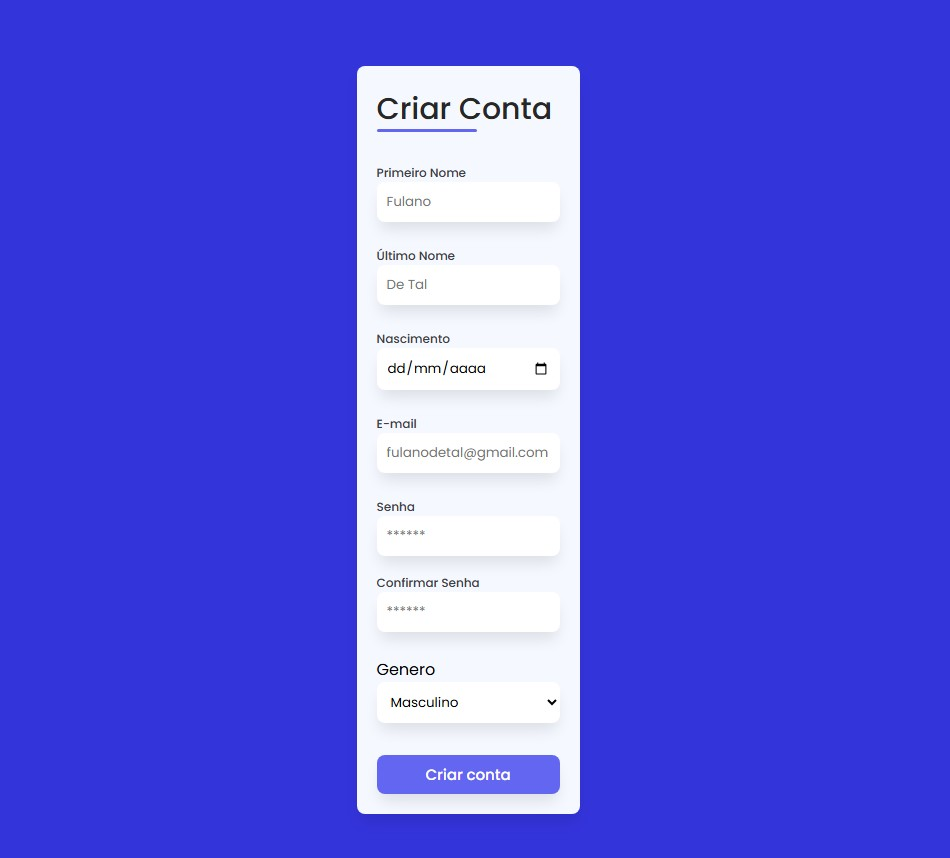

<h1 align="center"> Formulário de Cadastro </h1>

Formulário criado durante o aprendizado como Dev FrontEnd, com intuito de inclusão ao meu portfólio.

  <a href="#-tecnologias">Tecnologias</a>&nbsp;&nbsp;&nbsp;|&nbsp;&nbsp;&nbsp;
  <a href="#-projeto">Projeto</a>&nbsp;&nbsp;&nbsp;|&nbsp;&nbsp;&nbsp;
  <a href="#memo-licença">Licença</a>

  

 

## 🚀 Tecnologias

Esse projeto foi desenvolvido com as seguintes tecnologias:

- HTML e CSS
- Git e Github

## 💻 Projeto

O formulário de cadastro foi criado para coleta de dados do usuário, com objetivo de criação de login a uma plataforma.

## :memo: Licença

Esse projeto está sob a licença MIT.

---

Feito com ♥ by me :wave: 